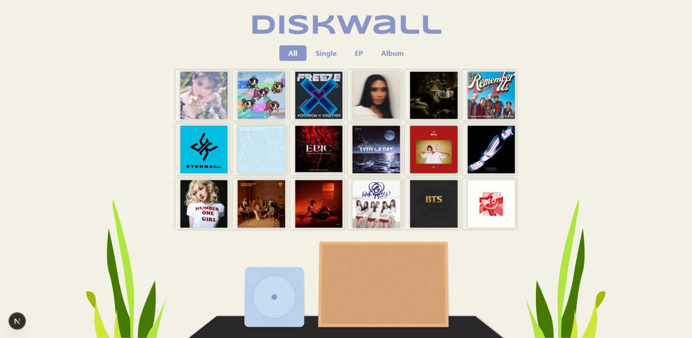
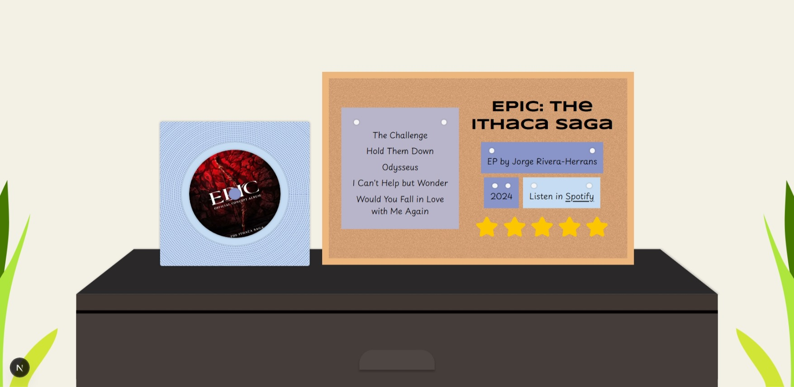

# DiskWall

> This project was developed for SISTECH 2025 Front-End Engineering Hands-On Task 2. The goal is to build a mini application using React and NextJs. 

## Project Overview

**DiskWall** is a music showcase web app inspired by a physical CD wall. It's built for desktop users to browse a curated wall of albums, hover for quick info, and click into each disk to explore more. The project highlights the key frontend engineering practices such as modular components, dynamic routes, stateful interactions, and contextual styling. 

## Web Preview

### Home Page


### Album Detail Page



## Technologies Used

- Framework: Next.js (App Router)
- Styling: Tailwind CSS
- Icons: Lucide
- Image Handling: next/image
- State Management: useState, useEffect

## Update History

| Date             | Description                                                 | 
|---------------|-------------------------------------------------------------|
| 15 Jul 2025   | Initial Next.js project setup                            | 
| 18 Jul 2025   | Home and Detail page completed                                  | 
| 19 Jul 2025   | Add more album entries, updated styling                                |
| 20 Jul 2025   | Add rating system, type-based filter, and hover reveal info     |

## Future Enhancements

- [ ] Connect to real-time music API (e.g., Spotify or Deezer) 
- [ ] Add mobile responsiveness and accessibility support
- [ ] Allow users to search albums by year, rating, or artist
- [ ] Animate shelf transitions when switching between pages
- [ ] Enhance overall user experience

## How to Run

1. Clone the repository:
```bash
    git clone https://github.com/arisarae/mini_games.git
```

2. Navigate to the project directory:
    
```bash
    cd diskwall
```

3. Install dependencies
```bash
    npm install
    # or
    yarn install
```

4. Run the development server
```bash
    npm run dev
    # or
    yarn dev
```

5. Open [http://localhost:3000](http://localhost:3000) in Chrome or any web browser. 

## Contributing

Feel free to fork this repository and make a pull requests. For major changes, please open an issue first to discuss what you would like to change.

## Contact

Created by [Arisa Rae](https://www.linkedin.com/in/arisa-raezzura/) - feel free to contact me!